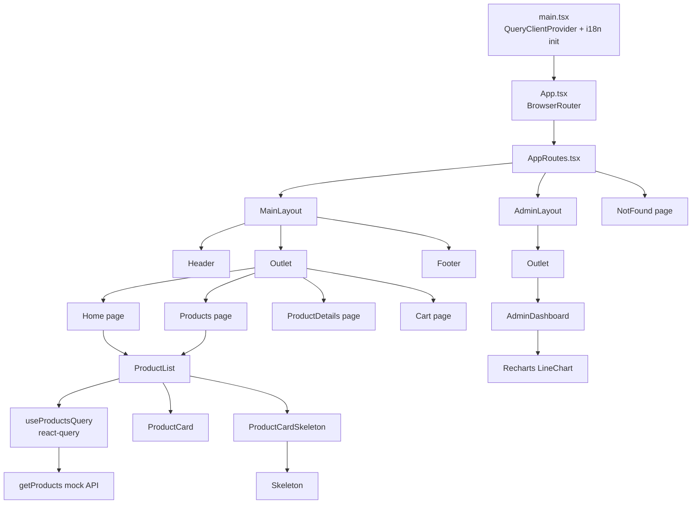

# Component Map (Phase 1)

```mermaid
flowchart TD
  main[main.tsx\nQueryClientProvider + i18n init] --> app[App.tsx\nBrowserRouter]
  app --> routes[AppRoutes.tsx]

  routes --> mainLayout[MainLayout]
  routes --> adminLayout[AdminLayout]

  %% Main layout area
  mainLayout --> header[Header]
  mainLayout --> outlet1[Outlet]
  mainLayout --> footer[Footer]

  outlet1 --> home[Home page]
  outlet1 --> products[Products page]
  outlet1 --> productDetails[ProductDetails page]
  outlet1 --> cart[Cart page]
  routes --> notFound[NotFound page]

  %% Home + Products use ProductList
  home --> productList[ProductList]
  products --> productList
  productList --> productsQuery[useProductsQuery\nreact-query]
  productsQuery --> api[getProducts mock API]
  productList --> productCard[ProductCard]
  productList --> productCardSkeleton[ProductCardSkeleton]
  productCardSkeleton --> skeleton[Skeleton]

  %% Admin area
  adminLayout --> outlet2[Outlet]
  outlet2 --> adminDashboard[AdminDashboard]
  adminDashboard --> recharts[Recharts LineChart]
```

